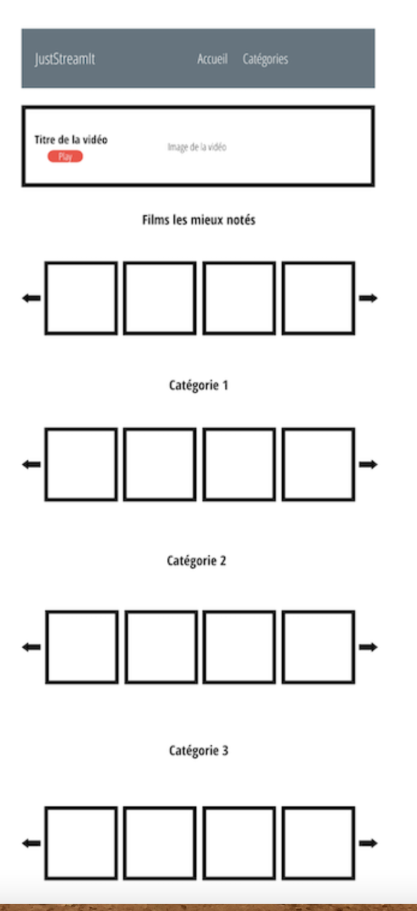
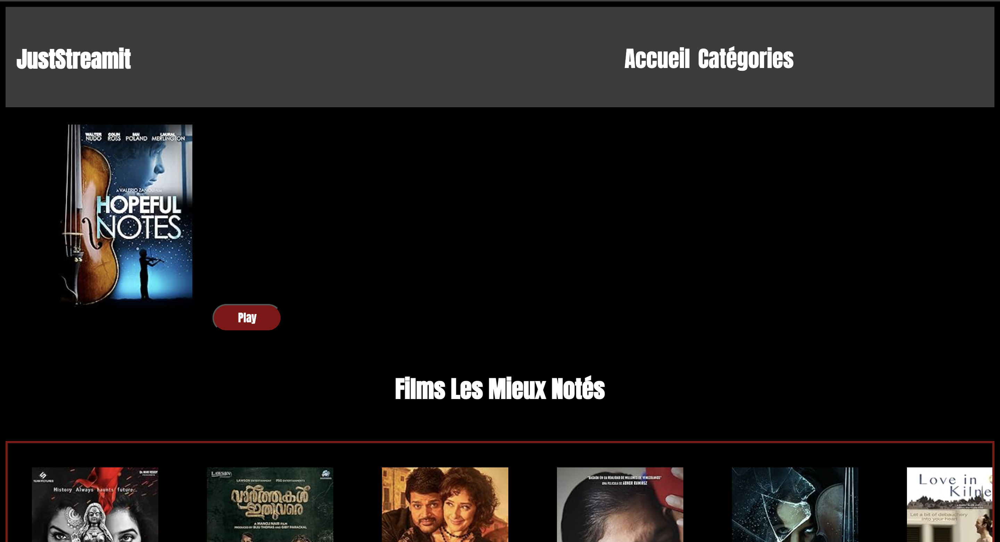
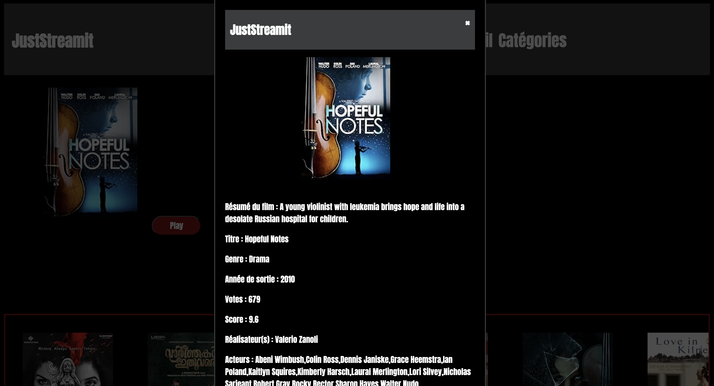
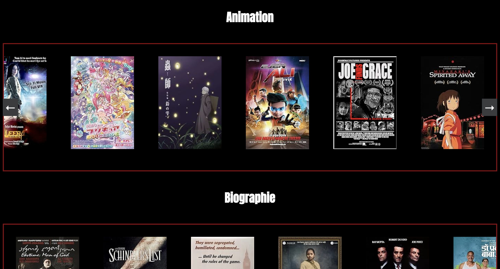
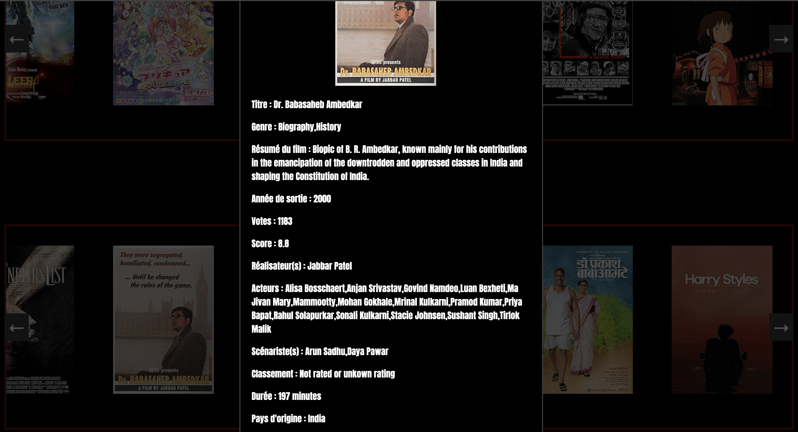

## Project : Develop a user interface for a web application.

<p>
  
  
  
  
  
</p>

### Table of contents :
1. Project description/Scenario.
2. Compatible configurations.
3. Installing the program.
4. Features that needed to be implemented.
5. Running the program.

## 1. Project description/Scenario :

This project was carried out as part of the Python Developer training offered by OpenClassrooms.

JustStreamIt hired me to develop a web application allowing users to view a real-time list of recommended movies. 
The application design is based on an existing wireframe and will be compatible with the three main browsers.
Movie data was collected through an API and processed to ensure relevance and quality.
The development of this project, namely the user interface (UI), involved the use of JavaScript, CSS, and HTML.

## 2. Compatible configurations :

* JavaScript
* HTML5
* CSS3
* Windows 10
* Mac
* Linux

## 3. Installing the program :
This project uses the following libraries :

```
asgiref 3.7.2
Django 5.0
django-cors-headers 4.3.1
django-extensions 3.2.3
django-filter 23.5
django-rest-framework 0.1.0
django-tqdm 1.3.1
djangorestframework 3.14.0
Markdown 3.5.1
pytz 2023.3.post1
sqlparse 0.4.4
tqdm 4.66.1

```

## 4. Features that needed to be implemented :

 *Feature 1* : Building a UI based on wireframes. \
 *Feature 2* : Fetch movie data (image, title, rating...) from OCMovies-API using requests and displaying them correctly on the interface. \
 *Feature 3* : Creating modal windows for each movie.

## 5. Running the program :

1. Open a terminal (e.g., Cygwin for Windows, Terminal for Mac).
2. Clone this repository using :
   > $<b> git clone https://github.com/MEDLAO/API-Calls-UI.git </b> 
3. Follow the instructions at this link [**OCMovies-API**](https://github.com/OpenClassrooms-Student-Center/OCMovies-API-EN-FR?tab=readme-ov-file)
4. Finally, open index.html file in a browser.


---
